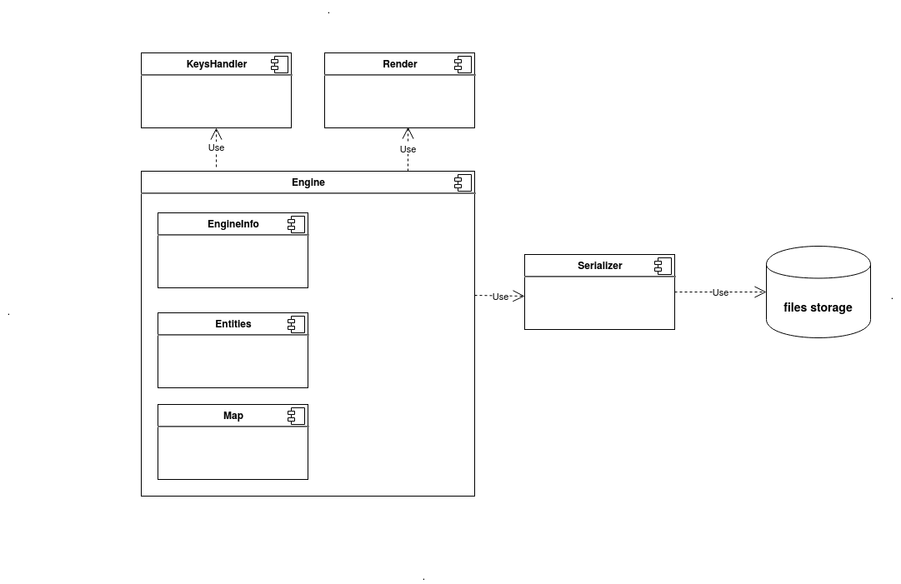
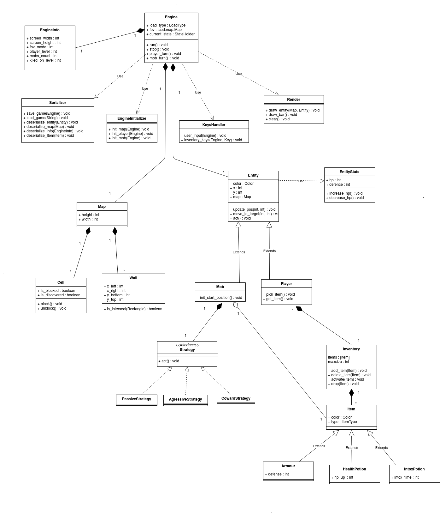
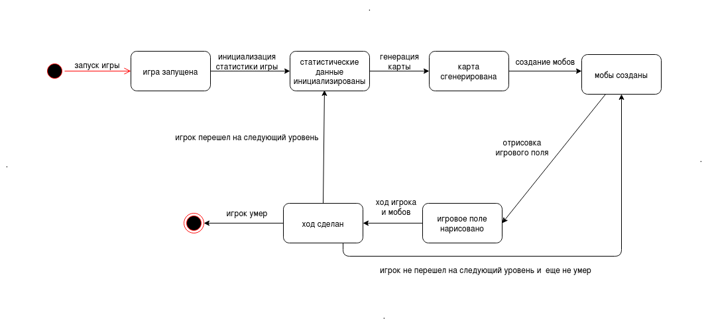

# Roguelike 

### Общие сведения о системе

#### Назначение

Данная система реализует игру жанра Roguelike.
Игровое поле представляет собой карту-лабиринт,
которая  генерируется случайным образом.
В игре есть 4 вида персонажей: 
- главный герой, которым управляет пользователь
- 3 вида мобов с разным поведением: 
   * красные: нападают на героя, как только он попадает в их поле видимости
   * зеленые: стоят на месте
   * синие: убегают от героя
   
Управление главным героем осуществлятся с помощью клавиатуры: стрелок вверх, вниз, влево, вправо.
При попытке занять одну клетку существа атакуют друг друга.
При атаке на моба персонаж получает опыт и его уровень растет.
Если же моб атакует героя, то у него уменьшается здоровье. 

Генерация карты: карта либо генерируется случайно, либо загружается из файла. 
Для того, чтобы создать карту, нужно создать json файл, в котором записаны координаты
стен карты. Пример карты находится в ./media/SD_MAP.json. Изменять нужно именно этот файл.

Цель игры: уничтожить трех агрессивных мобов (красных) на поле и не умереть самому.

После того как персонаж уничтожил трех красных мобов, генерируется новая карта 
и появляются новые мобы. Характеристики игрока и мобов меняются с каждым уровнем.

При смерти персонажа игру нельзя восстановить, можно только начать заново.

#### Границы системы

- игра обладает консольной графикой, иное не предполагается

- управление игрой осуществляется только с помощью клавиатуры

- система однопользовательская

#### Контекст 

Игра предназначена для использования на декстопных компьютерах 
под управлением операционной системы Linux или Windows.

### Architectural drivers

#### Технические ограничения

- Аппаратные требоания:

    * Необходим десктопный компьютер с клавиатурой и дисплееем.
    
    * Требования на оперативную память: 1Gb 
    
    * Процессор intel/amd/arm 
    
    
- Программные требования:

   * Операционная система Linux или Windows c доступом к командной строке

   * Нужно, чтобы у пользователя был установлен python версии не менее 3.7

   * Зависимости: необходима установка библиотеки tcod

#### Бизнес-ограничения

Игру необходимо реализовать до 30.06.2020

#### Качественные характеристики системы

Код должен быть расширяемый в рамках функциональных 
требований системы. Добавление принципиально нового после релиза не планируется.
Код должен быть сопровождаемым: нужно, чтобы было как можно проще исправлять баги.

#### Ключевые функциональные требования

- Персонаж игрока, способный перемещаться по карте,
управляемый с клавиатуры
- Консольная графика
- Карта должна на выбор пользователя случайно генерироваться или грузиться из файла 
- Характеристики персонажа — здоровье, сила атаки и т.д.
- Экспа и уровни персонажа, с ростом уровня повышаются
характеристики
- Инвентарь персонажа, включающий элементы, влияющие на его
характеристики, которые можно надеть и снять
- Несколько разных видов мобов, способных перемещаться по
карте
- Боевая система — движущиеся объекты, пытающиеся занять
одну клетку карты, атакуют друг друга

### Роли и случаи использования

#### Администратор

Устанавливает операционную систему, python нужной версии, 
зависимости и копирует репозиторий с игрой на компьютер.

#### Пользователь

Запускает игру. Выбирает режим запуска игры: запустить новую игру со случайной генерацией карты,
запустить новую игру с загрузкой карты из файла или
загрузить последнее
сохранение игры.

### Композиция 

#### Диаграмма компонентов

Система состоит из нескольких компонентов: 
основной компонент -- это Engine -- движок игры.
Он содержит в себе карту, сущности, и EngineInfo -- компонет,
который отвечает за информацию о состоянии игры. 
У Engine есть метод run(), который запускает игру.
Так же есть несколько вспомогательных компонентов.
Компонент Render отвечает за отрисовку всего на экране.
Компонент KeysHandler отвечает за обработку нажатия клавиш.
Engine использует компонент Serializer для того, чтобы загружать карту и последнее сохранение
игры в формате json. 

### Логическая структура

#### Диаграмма классов

Класс, который запускает игру -- класс Engine, у которого есть 
метод run(). Engine содержит в качестве поля карту,
игрока и мобов и EngineInfo -- класс, который отвечает за информацию о состоянии игры.
Классы Render, Serializer и KeysHandler -- вспомогательные для Engine.

Класс карты -- Map. Карта содержит клетки игрового поля,
комнаты и стены.

Класс Entity -- базовый класс всех сущностей на карте. 
К Entity относится игрок (Player) и мобы (Mob).
У игрока есть инвентарь Inventory, у моба есть стратегия Startegy.
Также у моба есть Item -- предмет, который может быть равен null.
То есть его может и не быть.

Strategy имеет один абстрактный метод act(). 
PassiveStrategy, CowardStrategy, AgressiveStrategy 
реализуют различные стратегии -- то есть имеют свою реализацию метода
act().

Item -- базовый класс любого предмета из инвентаря,
инвентарем являются Armour, IntoxPotion, HealthPotion.

Inventory содержит список предметов инвентаря,
и имеет методы, которые позволяют работать с этим списком. 

### Взаимодействия и состояния 

#### Диаграмма конечных состояний

На диаграмме показан жизненный цикл игры. 
При запуске игры инициализируется статистика игры -- 
то есть начальные характеристики игрока (например, здоровье)
и мобов. Дальше создается карта и мобы.
Затем созданные сущности рисуются на экране. 
Игрок делает ход (нажимает клавишу) и ситуация игры меняется.
Может произойти одно из трех событий: 
1) игрок передвинулся на 1 клетку -- он мог кого-то атаковать или его могли 
атаковать. Но hp еще > 0.
2) игрок уничтожил последнего из 3-х агрессивных мобов. Он должен перейти на следующий уровень.
3) игрока атаковали, отобрав последние hp. Игрок умирает.

В 1 случае происходит перерисовка игрового поля, так как за ход 
координаты сущностей изменились.
Во 2 случае происходит генерация новой карты и создаются новые мобы.
В 3 случае игра закончена.