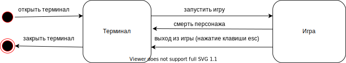

# Roguelike 

###Общие сведения о системе

#### Назначение

Данная система реализует игру жанра Roguelike.
Игровое поле представляет собой карту-лабиринт,
которая  генерируется случайным образом.
В игре есть 4 вида персонажей: 
- главный герой, которым управляет пользователь
- 3 вида мобов с разным поведением: 
   * красные: нападают на героя, как только он попадает в их поле видимости
   * зеленые: стоят на месте
   * синие: убегают от героя
   
Управление главным героем осуществлятся с помощью клавиатуры: стрелок вверх, вниз, влево, вправо.
При попытке занять одну клетку существа атакуют друг друга.
При атаке на моба персонаж получает опыт и его уровень растет.
Если же моб атакует героя, то у него уменьшается здоровье. 

Цель игры: уничтожить всех мобов на поле и не умереть самому.

После того как персонаж уничтожил всех мобов на карте, генерируется новая карта 
и появляются новые мобы, количество которых с каждым разом возрастает.

При смерти персонажа игру нельзя восстановить, можно только начать заново.

#### Границы системы

- игра обладает консольной графикой, иное не предполагается

- управление игрой осуществляется только с помощью клавиатуры

- система однопользовательская

#### Контекст 

Игра предназначена для использования на декстопных компьютерах 
под управлением операционной системы Linux или Windows.

###Architectural drivers

#### Технические ограничения

- Аппаратные требоания:

    * Необходим десктопный компьютер с клавиатурой и дисплееем.
    
    * Требования на оперативную память: 1Gb 
    
    * Процессор intel/amd/arm 
    
    
- Программные требования:

   * Операционная система Linux или Windows c доступом к командной строке

   * Нужно, чтобы у пользователя был установлен python версии не менее 3.7

   * Зависимости: необходима установка библиотеки tcod

#### Бизнес-ограничения

Игру необходимо реализовать до 30.06.2020

#### Качественные характеристики системы

Код должен быть расширяемый в рамках функциональных 
требований системы. Добавление принципиально нового после релиза не планируется.
Код должен быть сопровождаемым: нужно, чтобы было как можно проще исправлять баги.

#### Ключевые функциональные требования

- Персонаж игрока, способный перемещаться по карте,
управляемый с клавиатуры
- Консольная графика
- Характеристики персонажа — здоровье, сила атаки и т.д.
- Экспа и уровни персонажа, с ростом уровня повышаются
характеристики
- Инвентарь персонажа, включающий элементы, влияющие на его
характеристики, которые можно надеть и снять
- Несколько разных видов мобов, способных перемещаться по
карте
- Боевая система — движущиеся объекты, пытающиеся занять
одну клетку карты, атакуют друг друга

###Роли и случаи использования

#### Администратор

Устанавливает операционную систему, python нужной версии, 
зависимости и копирует репозиторий с игрой на компьютер.

#### Пользователь

Запускает игру.

###Композиция 

###Логическая структура

###Взаимодействия и состояния 

#### Диаграмма конечных состояний

На диаграмме показаны два состояния пользователя: "терминал" и "игра".
В состояние "терминал" пользователь попадает, когда открывает терминал.
Из состояния "терминал" можно запустить игру.
Из состояния "игра" есть два способа вернуться в состояние "терминал":
либо смерть персонажа, либо нажатие пользователем клавиши escape.

